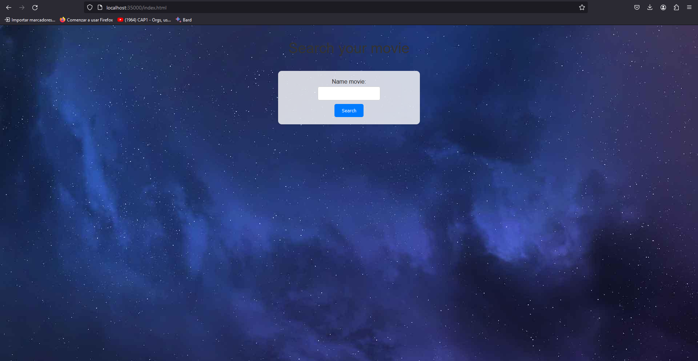

# TALLER DISEÑO Y ESTRUCTURACIÓN DE APLICACIONES DISTRIBUIDAS EN INTERNET (Taller 2)

## RETO 

Escriba un servidor web que soporte múlltiples solicitudes seguidas (no concurrentes). El servidor debe leer los archivos del disco local y retornar todos los archivos solicitados, incluyendo páginas html, archivos java script, css e imágenes. Construya una aplicación web con  javascript, css, e imágenes para probar su servidor. Incluya en la aplicación la comunicación asíncrona con unos servicios REST en el backend. NO use frameworks web como Spark o Spring, use solo Java y las librerías para manejo de la red.

## Diseño

1. Clase Principal: HttpServer 
-   Método main: Es el punto de entrada principal del programa. Inicia un servidor en el puerto 35000 y espera conexiones entrantes. Por cada conexión entrante, establece flujos de entrada/salida, procesa la solicitud del cliente y envía la respuesta correspondiente.

2. Manejo de Conexiones:

-   Se utiliza un bucle while para esperar continuamente conexiones entrantes.
    Se acepta la conexión mediante serverSocket.accept() y se configuran flujos de entrada/salida para la comunicación con el cliente.

3. Procesamiento de Solicitudes:

-   Se lee la solicitud del cliente línea por línea, extrayendo la URI de la primera línea.
- La URI se convierte en un objeto URI y se utiliza para generar el encabezado y cuerpo de la respuesta.

4. Generación de Respuestas:

-   httpOkResponseHeader: Genera el encabezado de una respuesta HTTP exitosa (código 200 OK) con el tipo de contenido adecuado.
-   httpOkResponseBody: Genera el cuerpo de una respuesta HTTP exitosa. Si la solicitud es para una imagen JPEG, la convierte en bytes; de lo contrario, lee el contenido del archivo.
-   convertImageToBytes: Convierte una imagen en bytes utilizando la biblioteca ImageIO.
-   httpErrorResponseHeader y httpErrorResponseBody: Generan el encabezado y cuerpo de una respuesta HTTP de error (código 400 Not Found).

5. Determinación del Tipo de Contenido:

-   El método getContentType devuelve el tipo de contenido según la extensión del archivo solicitado. Admite HTML, CSS, JavaScript, imágenes JPEG y cualquier otro tipo de archivo como "application/octet-stream".

## Instrucciones de uso 

- Para hacer uso del programa son necesarias tener instalado lo siguiente:
    - Java (JKD)
    - maven 

1. Abra su consola de comandos y clone el repositorio 
```
$ git clone https://github.com/MiguelBarreraD/Aplicaciones-Distribuidas-2
```
2. Ingrese a la carpeta del repositorio:
```
$ cd .\Aplicaciones-Distribuidas-2\
```
3. Compile el poyecto:
```
$ mvn package
```
4. Una vez compilado el proyecto, ejecute el siguiente comando para iniciar el programa (asegúrese de estar dentro de la carpeta principal):
```
$ java -cp .\target\classes\ org.example.HttpServer
```
5. Finalmente, acceda a la siguiente URL en su navegador para utilizar la aplicación:
```
→ http://localhost:35000/index.html
```
6. Dentro de la aplicación, encontrará la interfaz principal.
-   Ingrese el nombre de la película que desea consultar y seleccione el botón 'Search'.

7. A continuación podra ver toda la información de la pelicula consultada.
    

## Pruebas unitarias
Para realizar pruebas unitarias ejecute el siguiente comando:
```
$ mvn test
```

### Autor
 - Miguel Angel Barrea Diaz